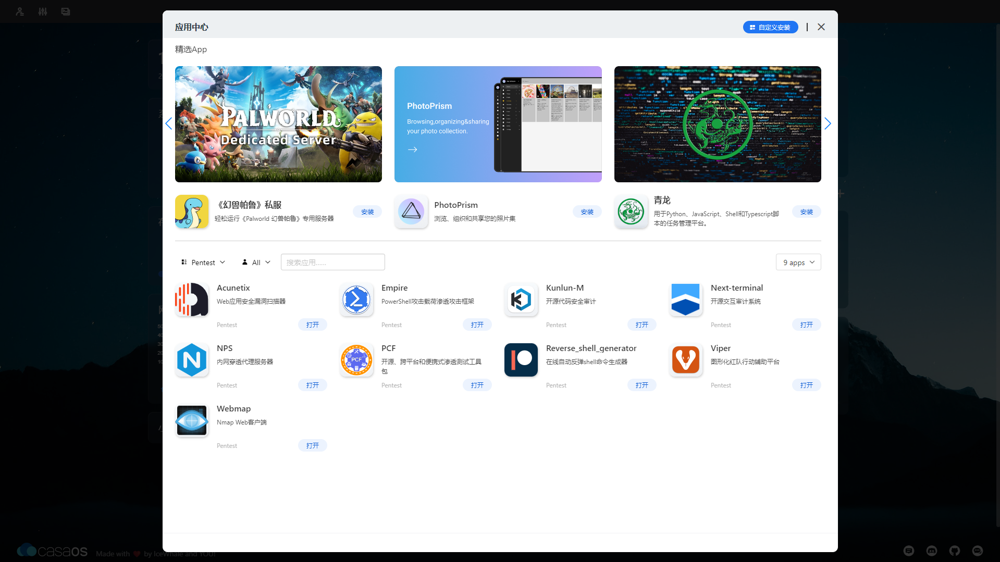
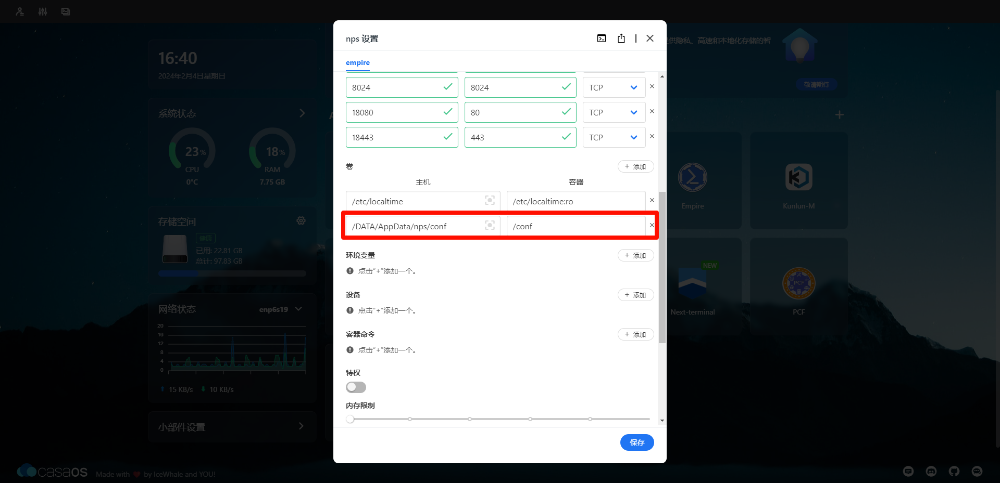
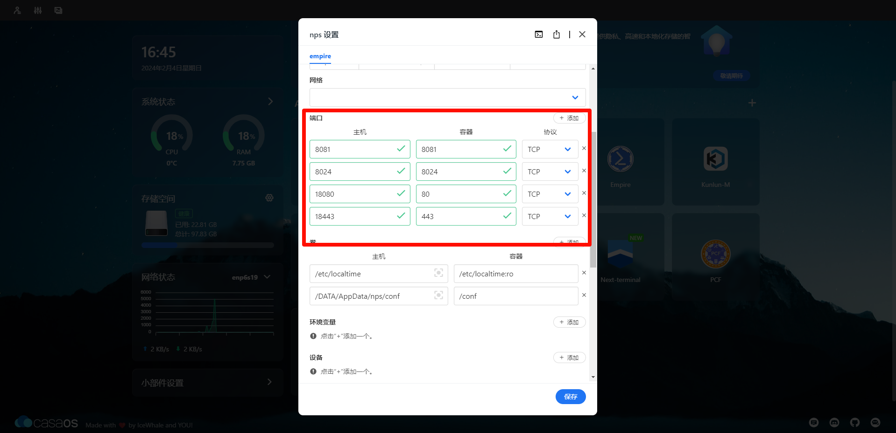

### 工具介绍

nps是一款轻量级、高性能、功能强大的**内网穿透**代理服务器。目前支持**tcp、udp流量转发**，可支持任何**tcp、udp**上层协议（访问内网网站、本地支付接口调试、ssh访问、远程桌面，内网dns解析等等……），此外还**支持内网http代理、内网socks5代理**、**p2p等**，并带有功能强大的web管理端。

### 版本说明

由于nps已经长时间未更新，存留了不少bug、漏洞和未完善的功能，此版本基于 nps 0.26.10的基础上二次开发而来。

当前版本号：0.26.17，由`yisier`维护，项目地址：https://github.com/yisier/nps

### 工具截图

### 应用场景

1. 做微信公众号开发、小程序开发等----> 域名代理模式

2. 想在外网通过ssh连接内网的机器，做云服务器到内网服务器端口的映射，----> tcp代理模式

3. 在非内网环境下使用内网dns，或者需要通过udp访问内网机器等----> udp代理模式

4. 在外网使用HTTP代理访问内网站点----> http代理模式

5. 搭建一个内网穿透ss，在外网如同使用内网vpn一样访问内网资源或者设备----> socks5代理模式

### 工具特点

- 协议支持全面，兼容几乎所有常用协议，例如tcp、udp、http(s)、socks5、p2p、http代理...
- 全平台兼容(linux、windows、macos、群辉等)，支持一键安装为系统服务
- 控制全面，同时支持服务端和客户端控制
- https集成，支持将后端代理和web服务转成https，同时支持多证书
- 操作简单，只需简单的配置即可在web ui上完成其余操作
- 展示信息全面，流量、系统信息、即时带宽、客户端版本等
- 扩展功能强大，该有的都有了（缓存、压缩、加密、流量限制、带宽限制、端口复用等等）
- 域名解析具备自定义header、404页面配置、host修改、站点保护、URL路由、泛解析等功能
- 服务端支持多用户和用户注册功能

**没找到你想要的功能？不要紧，点击[进入文档](https://ehang-io.github.io/nps)查找吧**

### 使用文档

#### 安装

在应用中心，找到NPS，点击安装，等待安装完成即可。（添加仓库文档请参考项目首页文档）

### 添加配置文件

1. 将本目录下conf文件夹上传至`/DATA/AppData/nps/` 目录下；

2. 设置nps应用，添加 `/DATA/AppData/nps/conf`映射到容器内的`/conf`目录

3. 通过Files应用，修改nps.conf文件后保存，并重启启动NPS应用

###  添加端口映射

在NPS中设置代理后，同理需要在NPS应用设置中，添加相应的端口映射。(PS:暂时无法设置网络为host模式，所以需要自行添加端口映射)

- 默认端口

nps默认配置文件使用了80，443，8080，8024端口

80与443端口为域名解析模式默认端口

8080为web管理访问端口

8024为网桥端口，用于客户端与服务器通信

可根据个人需求，自行添加端口映射
